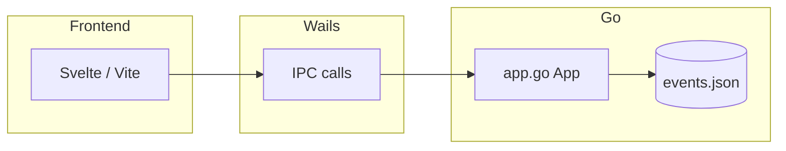

# calender

A desktop calendar app packaged with **Wails v2**, using a **Go** backend and **Svelte** frontend. Events are stored only on your machine in a single JSON file—no server or account required.

---

## Features

- Month grid view with previous / next month controls.
- **Right-click** a day to add an event (title via `prompt`; default color is a yellow tone).
- **Right-click** an event row to delete that entry.
- Persistent storage; data reloads when you reopen the app.
- Dates use `YYYY-MM-DD` in the **local** calendar day—no UTC shift from `toISOString()`.

---

## Tech stack

| Component | Role | In this project (approx.) |
|-----------|------|---------------------------|
| **Wails** | Go ↔ WebView bridge, desktop packaging | v2.12.0 |
| **Go** | Backend, file I/O, JSON | 1.23+ |
| **Svelte** | UI components | 3.x |
| **Vite** | Frontend bundler and dev server | 3.x |
| **uuid** | Unique event IDs | `google/uuid` |

The frontend lives under `frontend/`; production assets go to `frontend/dist/` and are embedded into the binary via `//go:embed` in `main.go`.

---

## Architecture (overview)

1. **Startup:** `main.go` runs the Wails app and **binds** the `App` struct to the frontend.
2. **Frontend:** `App.svelte` renders the calendar; it calls `GetEvents`, `AddEvent`, and `DeleteEvent` through `frontend/wailsjs/go/main/App.js` (generated by `wails generate` / `wails build`—do not edit by hand).
3. **Data:** An in-memory list in `app.go`, guarded by `sync.Mutex`; each add/delete writes JSON to disk.



---

## Backend API (`app.go`)

| Method | Behavior |
|--------|----------|
| `GetEvents()` | Returns all events (current in-memory copy). |
| `AddEvent(date, title, color string)` | Date must be `YYYY-MM-DD`; title cannot be empty; empty `color` defaults to `#facc15`. Persists on success. |
| `DeleteEvent(id string)` | Deletes the row with that `id`; returns an error if not found. |

**Storage details:**

- Path: `filepath.Join(os.UserConfigDir(), "calender", "events.json")`.
- Writes use a temp file (`*.tmp`) plus `rename` for atomic replacement (reduces risk of a half-written file on crash).
- If `UserConfigDir` fails, `cfg` falls back to `"."`, so the path becomes `./calender/events.json`.

---

## Frontend behavior

- **Initial load:** `onMount` uses `await loadEvents()` so the first paint waits for backend data (where applicable).
- **Race handling:** If `GetEvents` is slow and the user adds an event, a `loadGeneration` counter prevents a late `GetEvents` response from overwriting the list; successful add/delete bumps the counter.
- **Date strings:** Local year/month/day are used instead of `toISOString()` so timezone skew does not move events across calendar days.
- **Browser-only dev:** When `window.go` is missing (plain `npm run dev`), sample events are shown; nothing is persisted.

---

## Requirements

- [Go](https://go.dev/dl/) (prefer a version compatible with `go.mod`)
- [Node.js](https://nodejs.org/) and npm
- [Wails CLI v2](https://wails.io/docs/gettingstarted/installation) (`wails` on your `PATH`)

Verify your setup:

```bash
go version
node -v
npm -v
wails version
```

---

## Setup and development

After cloning or extracting the repo:

```bash
cd calender
```

Install frontend dependencies once:

```bash
cd frontend && npm install && cd ..
```

Live development (recommended):

```bash
wails dev
```

Vite provides fast HMR for the frontend. If you change **Go** code (`app.go`, `main.go`), you usually need to restart `wails dev`. If you change Go method signatures exposed to the frontend, run:

```bash
wails generate module
```

or let the next `wails build` / `wails dev` regenerate bindings.

Frontend only (no Wails):

```bash
cd frontend && npm run dev
```

Opens in the browser; the Go API is unavailable and the app uses sample data.

---

## Production build

```bash
wails build
```

Output is typically `build/bin/calender` (Linux/macOS) or `build\bin\calender.exe` (Windows). Adjust `outputfilename` and author metadata in `wails.json` as needed.

More options: [Wails build CLI docs](https://wails.io/docs/next/reference/cli#build).

---

## Data file

### Location

| OS | Typical path |
|----|----------------|
| Linux | `$XDG_CONFIG_HOME/calender/events.json` or `~/.config/calender/events.json` |
| macOS | `~/Library/Application Support/calender/events.json` (or your system’s `UserConfigDir` equivalent) |
| Windows | `%AppData%\calender\events.json` |

### Example payload

```json
[
  {
    "id": "550e8400-e29b-41d4-a716-446655440000",
    "date": "2026-04-05",
    "title": "Meeting",
    "color": "#4ade80"
  }
]
```

Copy this file to back up your events. To reset or test, delete or edit it (preferably while the app is closed).

---

## UI cheat sheet

| Action | Result |
|--------|--------|
| Left / right arrows | Previous or next month |
| Click a day | Selects that day (highlight) |
| Right-click a day | “Add Event”—enter title; event is added to that day |
| Right-click an event | “Sil” (Delete)—removes that entry |
| Click outside | Closes the open context menu |

---

## Project layout

```
calender/
├── main.go           # Wails entry, embedded static assets
├── app.go            # Event CRUD and JSON persistence
├── go.mod / go.sum
├── wails.json        # Wails project settings
├── frontend/
│   ├── src/
│   │   ├── App.svelte
│   │   ├── main.js
│   │   └── style.css
│   ├── index.html
│   ├── vite.config.js
│   ├── package.json
│   └── wailsjs/      # Generated Go bindings (do not edit)
└── build/            # wails build output (often gitignored)
```

---

## Troubleshooting

| Issue | Likely cause / fix |
|-------|---------------------|
| Events do not appear | Run via `wails dev` or the built binary; plain `npm run dev` has no Wails bridge. |
| New event disappears / old list flashes | Rare race between `loadEvents` and add; handled with `loadGeneration` in current code—use the latest sources. |
| Corrupt JSON | Invalid JSON may break `load`. Restore from backup or replace the file with `[]`. |
| `wails: command not found` | Install the Wails CLI and ensure it is on your `PATH`. |
